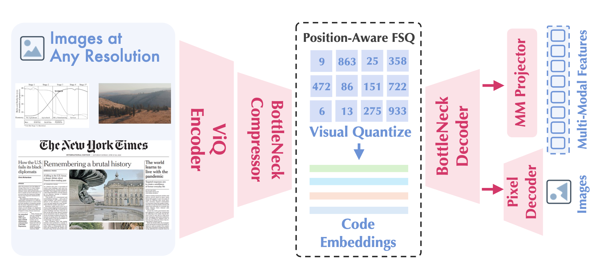
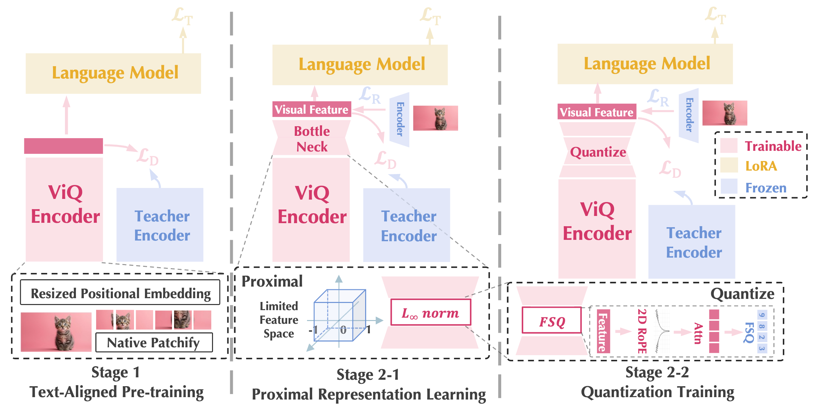
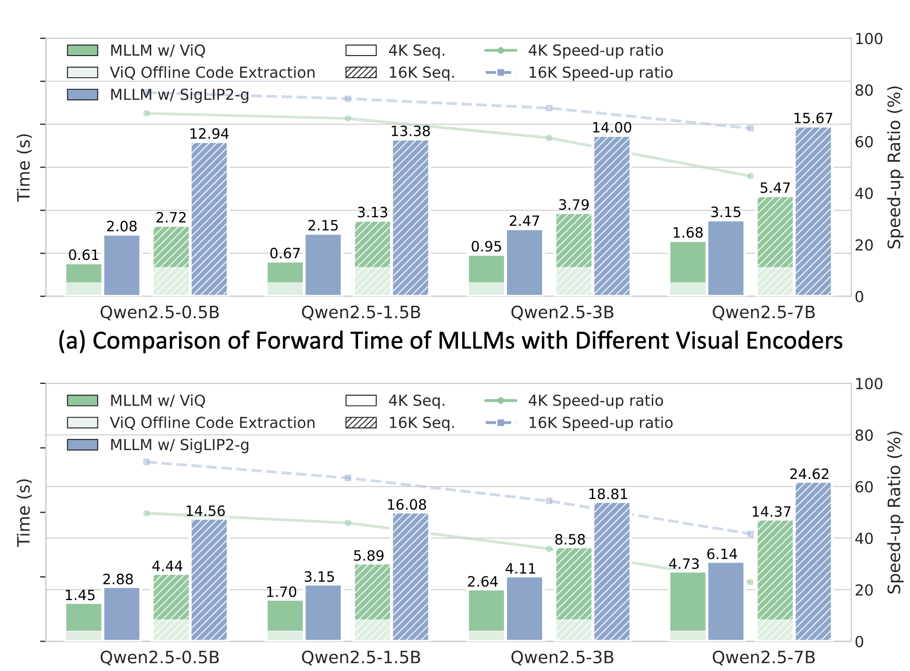

<p align="left">
    <a href="README_CN.md">中文</a>&nbsp;｜&nbsp;English
</p>
<br>

<p align="center">
  <br>
</p>

<div align="center">

# ✨ ViQ: Text-Aligned Visual Quantized Representations at Any Resolution ✨

<p align="center">
    <a href="https://yuxumin.github.io/">Xumin Yu</a><sup>1,*</sup>&emsp;
    Zuyan Liu<sup>1,2,*</sup>&emsp;
    Zhenyu Yang<sup>1,2,*</sup>&emsp;
    Yuhao Dong<sup>3</sup>
    <br>
    Shengsheng Qian<sup>4</sup>&emsp;
    Jiwen Lu<sup>2</sup>&emsp;
    <a href="https://ancientmooner.github.io/">Han Hu</a><sup>1</sup>&emsp;
    <a href="https://raoyongming.github.io/">Yongming Rao</a><sup>1,†</sup>
    <br>
    <sup>*</sup>Equal Contribution &emsp; <sup>†</sup>Corresponding Author
    <br>
    <sup>1</sup>Tencent HY Vision Team &emsp; <sup>2</sup>Tsinghua University
    <br>
    <sup>3</sup>Nanyang Technological University &emsp; <sup>4</sup>Institute of Automation, CAS
</p>

<div align="center" style="line-height: 1;">

[](https://arxiv.org/abs/2606.27313)
&nbsp;&nbsp;
[](https://huggingface.co/XuminYu/ViQ_weights)
&nbsp;&nbsp;
[](https://github.com/yuxumin/ViQ)

</div>



</div>

A unified representation for text and vision is a natural pursuit, as it enables simpler multimodal modeling and more efficient training. However, representing images as discrete signals in the same way as text inevitably introduces severe information loss: reconstruction-oriented representations often lack semantics, whereas semantically stronger features typically suffer from loss of detail.

<strong>ViQ</strong> (Visual Quantized Representations) is a framework designed to **balance semantics and details** in discrete visual representations while supporting **inputs at native resolutions** — serving as a unified, general discrete representation for arbitrary visual inputs. Built on a SigLIP2 vision tower with a position-aware, head-wise FSQ (Finite Scalar Quantization) head, ViQ turns an image at any resolution into a sequence of discrete codes that can feed either an MLLM (Qwen2.5 backbone) for understanding or a decoder for high-fidelity reconstruction.

---

## 📢 News

- **[2026/06]** 🔥 We release **ViQ** — both training and inference code. For training we provide a simple **single-stage** example that directly trains the 16k-FSQ ViQ; the paper's two-stage recipe (**2-1** Proximal Representation Learning and **2-2** Quantization Training) can be reproduced by toggling the flags in the training script.

## 🌟 Overview



**Approach of ViQ representation learning.** ViQ structures quantization learning into two stages. **(Stage 1) Text-Aligned Pre-training** aligns the ViQ encoder with semantic-rich supervision from a pretrained language model, while resized positional embedding and native patchify enable any-resolution inputs; a self-distillation loss against a fixed-resolution teacher preserves the foundational language-image knowledge. **Stage 2** discretizes the continuous features progressively: **(2-1) Proximal Representation Learning** compacts the latent space with an $L_\infty$-norm constraint to keep features close to quantization anchors, and **(2-2) Quantization Training** applies a position-aware, head-wise FSQ mechanism (with 2D RoPE and attention-based patch expansion) to map features to discrete codes, keeping the language model and teacher frozen and training only lightweight / LoRA components.

## 🌟 Introduction

Continuous visual encoders are intrinsically mismatched with the discrete, token-based modeling of text, and extracting their high-dimensional features places significant strain on multimodal training. Discrete tokenizers promise a unified alternative, but existing ones leave a large performance gap versus continuous encoders on tasks requiring textual understanding or fine-grained detail. ViQ closes that gap with the following key designs:

- **Text-aligned pre-training**: The encoder is optimized with language-model supervision so its features are directly compatible with multimodal learning, rather than only contrastively pre-trained.
- **Any-resolution input**: Following NaViT / OryxViT, resized positional embedding and native patchify let the model process images at arbitrary resolution efficiently.
- **Proximal representation learning**: A bottleneck plus an $L_\infty$-norm projects features onto a hypercube surface, progressively reducing feature-space complexity and minimizing information loss during quantization.
- **Position-aware multi-head FSQ**: Patches are expanded (e.g. into 2×2 codes) via multi-head self-attention and quantized with FSQ, with 2D RoPE encoding spatial resolution — enabling flexible, independent codes at any resolution.

On nine multimodal benchmarks, ViQ reaches an average of **57.2** with Qwen2.5-1.5B and **63.9** with Qwen2.5-7B as the backbone LLM, competitive with state-of-the-art continuous encoders while remaining fully discrete; when paired with a decoder it also preserves rich low-level detail (PSNR 22.73, rFID 0.62).

## 🚀 Efficiency



Because ViQ produces discrete codes, they can be **extracted offline once** and reused, removing the heavy continuous-encoder forward pass from inside MLLM training. This yields **20%–70% speed-ups** across base LLM sizes (0.5B → 7B) and training recipes, with the gain growing as sequence length increases (4K → 16K).

## ⚙️ Setup

### 1. Clone Repository

```bash
git clone git@github.com:yuxumin/ViQ.git
cd ViQ
```

### 2. Environment Setup

We recommend Python 3.10+ with CUDA 12 / PyTorch 2.6. The full dependency list is in `scripts/build_env.sh`:

```bash
bash scripts/build_env.sh
```

Key packages: `transformers==4.49.0`, `accelerate==0.34.2`, `deepspeed==0.14.4`, `flash-attn==2.7.4.post1`, `diffusers==0.32.2`, `peft==0.11.1`. If you have a prebuilt FlashAttention wheel matching your CUDA 12 / torch 2.6 / cp310 setup, place it at the repo root and install it directly (see the path inside `build_env.sh`).

### 3. Download Pretrained Weights

Download the following source weights into the repo root with the exact folder names below before training:

| Source | Local folder |
| --- | --- |
| `timm/ViT-SO400M-16-SigLIP2-384` | `siglip2_so400m_384_16/` |
| `timm/ViT-gopt-16-SigLIP2-384`   | `siglip2_g_384_16/` |
| `Qwen/Qwen2.5-0.5B`              | `Qwen2.5-0.5B/` |
| `Qwen/Qwen-Image`              | `Qwen-Image/` |


```bash
huggingface-cli download timm/ViT-SO400M-16-SigLIP2-384 --local-dir siglip2_so400m_384_16
huggingface-cli download timm/ViT-gopt-16-SigLIP2-384   --local-dir siglip2_g_384_16
huggingface-cli download Qwen/Qwen2.5-0.5B              --local-dir Qwen2.5-0.5B
huggingface-cli download Qwen/Qwen-Image            --local-dir Qwen-Image
```

## 🧩 ViQ Sizes

Each ViQ size corresponds to a different FSQ codebook. The dual-branch head uses these per-branch `levels`; `codebook_size` is the effective vocabulary.

| size  | levels                | codebook_size |
| ----- | --------------------- | ------------- |
| `2k`  | `[8, 8, 4, 3, 3]`     | 2304          |
| `4k`  | `[8, 8, 4, 4, 4]`     | 4096          |
| `8k`  | `[8, 8, 8, 4, 4]`     | 8192          |
| `16k` | `[8, 8, 8, 6, 5]`     | 15360         |
| `64k` | `[8, 8, 8, 5, 5, 5]`  | 64000         |

## 🚂 Training

We open-source a single, self-contained example script that **directly trains the 16k-FSQ ViQ on a SigLIP2-g (1B) backbone** in one stage:

```bash
bash scripts/example.sh
```
This example is the single-stage shortcut; the paper's progressive two-stage recipe — **(2-1)** Proximal Representation Learning and **(2-2)** Quantization Training — is reproduced by toggling the flags below (e.g. `VQ_LOW_TYPE` / `VQ_LOW_LIMIT` for the proximal stage vs. the real FSQ quantizer).

**Configuration.** Every knob is its own clearly-marked block in `scripts/example.sh` — a `# ===== NAME =====` rule, a short description, then the `export`. Representative switches:

| Switch | Meaning |
| --- | --- |
| `FSQ2K` / `FSQ4K` / `FSQ8K` / `FSQ16K` | select the FSQ codebook preset (set exactly one) |
| `VQ_LOW_TYPE` / `VQ_LOW_SIZE` / `VQ_LOW_LIMIT` | quantizer family (`fsq`, `simvq`, …), codebook size, and feature constraint (`none`/`l2`/`l_infinite`/`tanh`/`escape`) |
| `ADD_PRE_ATTN` / `ENABLE_ROPE` | attention-based patch expansion and 2D RoPE in the FSQ head |
| `MOVQ_TYPE` / `VAE_PATH` / `MOVQ_PREPROCESS_TYPE` | reconstruction decoder backend, its VAE weights, and the pre-decoder adapter |
| `TRAIN_CLS_TOKEN` / `CLS_DISTILL_FEATURE_TYPE` | self-distillation loss against the teacher and its target feature |
| `QUIET_PARAM_LOG` | (optional) silence the long per-parameter freeze/unfreeze dump at setup |

**Data format.** Training reads a `.json` (or `.jsonl`) list of samples; each sample carries a `conversations` list and an `image` list of `{ "img_path": ..., "resize": "<base>x<patch>" }` entries (the number of `<image>` tokens must match the number of images). See `scripts/example_dataset/example.json` for a minimal, working example.

> **Path management:** code resolves paths relative to a project root rather than hard-coded absolutes. `scripts/example.sh` locates the repo from its own location; `viq_train/llava_viq/_paths.py` sets `PROJECT_ROOT = $VIQ_ROOT` (falling back to the package parent, i.e. `viq_train/`) and calls `ensure_on_sys_path()`.

## 🎨 Reconstruction

ViQ codes can be decoded back to pixels. The reconstruction decoder is **trained in a separate stage** on top of a frozen, pretrained ViQ encoder: following the REPA idea, a lightweight decoder is supervised with a combination of KL, MSE, LPIPS, and GAN losses. This decoder achieves high-quality, high-compression-ratio reconstruction at native resolution.

> The lightweight decoder and its training recipe are **planned for a future release** (see below).

## 📊 Inference & Weight Conversion

Training produces a heavy `vision_tower.pth`. Inference uses a cleaned, lightweight ViQ-format weight produced by the converter.

**1. Convert** a training checkpoint into ViQ inference weights (and verify the conversion is lossless via a reconstruction-consistency check):

```bash
cd viq_inference/converter
# point IN_CKPT at your trained vision_tower.pth; --levels matches the FSQ size
IN_CKPT=/path/to/vision_tower.pth bash run_convert.sh
```

This writes, into `converted/`, three files: `model_viq_fsq.pth` (the encoder), `embedder.pth` (codes → MLLM features), and `index_drawer.pth` (codes → reconstructed image). To convert another size, change `--levels` (and optionally `--out_name`) in `run_convert.sh`, or call `convert_weight.py` directly:

```bash
python convert_weight.py --in_ckpt /path/to/vision_tower.pth \
    --out_dir converted_16k --out_name model_viq_fsq_16k.pth --levels 8 8 8 6 5
```

**2. Run inference** with the converted weights. `ViQ.py` looks for `converted_<size>/model_viq_fsq_<size>.pth` (with `embedder.pth` / `index_drawer.pth` alongside) under a weights root — by default `viq_inference/converter`, overridable via `--weights_root` or the `VIQ_WEIGHTS_ROOT` env var:

```bash
cd viq_inference
python ViQ.py --size 16k                        # demo / local images
python ViQ.py --size all                        # every size
python ViQ.py --size 16k --images a.jpg b.png   # your own images
python ViQ.py --size 16k --weights_root /path/to/ViQ_weights/ViQ   # external weights
```

Programmatic use:

```python
from ViQ import load_viq

vq = load_viq('16k')                                  # default weights root
vq = load_viq('16k', '/path/to/ViQ_weights/ViQ')      # external weights root
indices, sizes = vq.forward_indices(images)           # encode -> discrete codes
feats = vq.embedder(indices)                          # codes -> MLLM features
_, vae_latent, recon_np = vq.drawer(indices, sizes)   # codes -> reconstructed image
```

Both `ViQ.py` and `modeling_viq.py` share the same model definitions; the conversion has been verified to be lossless (the original training weights and the converted weights produce identical encode / embed / VAE-latent / reconstruction fingerprints).

## 🗺️ Roadmap

- [x] Release pretrained ViQ checkpoints on Hugging Face.
- [x] Release the paper.
- [ ] Release the lightweight reconstruction decoder and its REPA-based training recipe.

## 📁 Repository Structure

```
ViQ/
├── viq_train/                  # training code
│   ├── llava_viq/            #   main package (LLaVA/viq derived)
│   │   ├── _paths.py           #   PROJECT_ROOT resolution + sys.path setup
│   │   ├── train/train.py      #   training entry point
│   │   └── model/
│   │       ├── language_model/        # Qwen2.5 LLM wrapper
│   │       └── multimodal_encoder/
│   │           ├── encoders/          # siglip_vit_anyres{,_viq}.py
│   │           ├── heads/             # dual_vq_head.py, vae_heads.py, movq/vitvq
│   │           ├── quantizers/        # fsq / bsq / lfq / simvq / vq ...
│   │           ├── losses/            # lpips, perceptual
│   │           └── vae/               # autoencoder_kl_qwenimage, ldm
├── viq_inference/              # inference code
│   ├── modeling_viq.py         #   shared model defs (AnyResViqVQWrapper, IndexEmbeder ...)
│   ├── ViQ.py                  #   inference entry: load_viq(size, weights_root)
│   └── converter/              # training-weight → ViQ-inference-weight conversion
│       ├── convert_weight.py   #     convert + lossless reconstruction-consistency check
│       └── run_convert.sh      #     thin launcher around convert_weight.py
├── scripts/                    # launch scripts + env setup
│   ├── build_env.sh            #   pip dependency install
│   ├── zero1.json              #   deepspeed config
│   ├── example.sh              #   end-to-end 16k-FSQ training example (single GPU)
│   └── example_dataset/        #   tiny self-contained demo dataset (json + images)
├── assets/                     # figures and demo images
└── README.md
```

## 📚 Citation

If you find ViQ useful for your research, please cite:

```bibtex
@article{yu2026viq,
  title   = {ViQ: Text-Aligned Visual Quantized Representations at Any Resolution},
  author  = {Yu, Xumin and Liu, Zuyan and Yang, Zhenyu and Dong, Yuhao and Qian, Shengsheng and Lu, Jiwen and Hu, Han and Rao, Yongming},
  journal = {arXiv preprint arXiv:2606.27313},
  year    = {2026}
}
```

## 🙏 Acknowledgements

Thanks to these great repositories and works: [LLaVA](https://github.com/haotian-liu/LLaVA), [Oryx](https://github.com/Oryx-mllm/Oryx), [Qwen2.5](https://github.com/QwenLM/Qwen2.5), [SigLIP2 (timm)](https://github.com/huggingface/pytorch-image-models), [diffusers](https://github.com/huggingface/diffusers), and the broader unified-multimodal community.

## 📜 License

This project is released under the **Apache License 2.0**. See [LICENSE](LICENSE) for the full terms.
